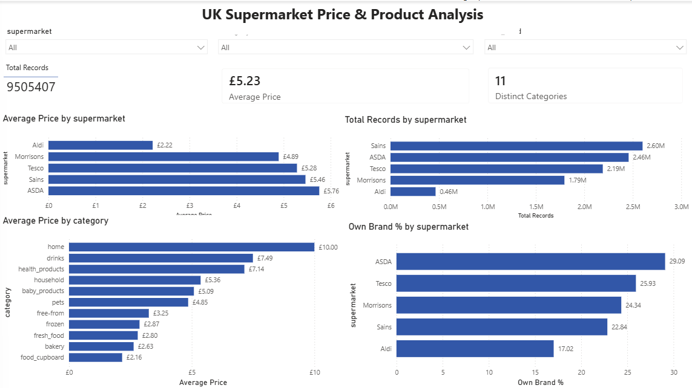
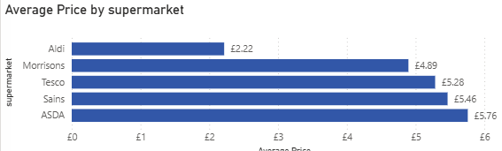
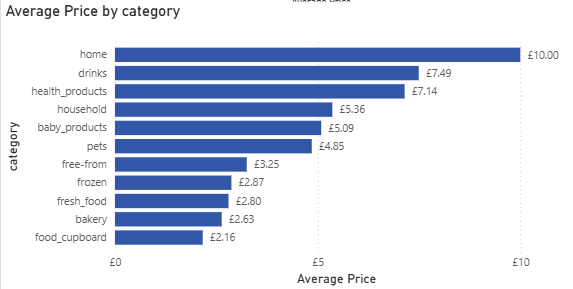
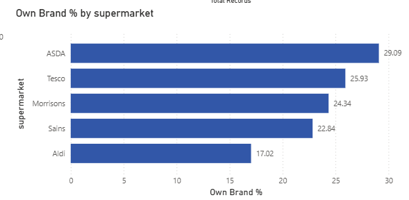

# UK Supermarket Data Quality & Price Analysis

An end-to-end data analytics project analysing more than 9.5 million supermarket product records from Aldi, ASDA, Morrisons, Sainsbury's and Tesco.

The project focuses on data profiling, data cleaning, SQL analysis and interactive visualisation to explore product pricing, category differences and own-brand presence across major UK supermarkets.

## Project Objectives

- Profile and assess the quality of raw supermarket data.
- Identify and handle missing values and duplicate records.
- Prepare clean, analysis-ready datasets using Python and Pandas.
- Use SQL to analyse supermarket pricing, product categories and own-brand presence.
- Build an interactive Power BI dashboard to communicate key findings.

## Dataset Overview

The project uses historical product-level data from five major UK supermarkets:

- Aldi
- ASDA
- Morrisons
- Sainsbury's
- Tesco

The combined cleaned dataset contains 9,505,407 records across 11 product categories.

The dataset includes the following fields:

- `supermarket` – supermarket name
- `prices_(£)` – listed product price
- `prices_unit_(£)` – price per unit
- `unit` – unit of measurement
- `names` – product name
- `date` – observation date
- `category` – product category
- `own_brand` – indicator identifying own-brand products

The data covers observations from January to April 2024.

## Data Quality & Cleaning

Before analysis, each supermarket dataset was profiled and cleaned using Python and Pandas.

The data-quality process included:

- Inspecting dataset dimensions, column names and data types.
- Identifying missing values across key fields.
- Checking for duplicate records.
- Reviewing category consistency across supermarkets.
- Investigating missing `unit` and `prices_unit_(£)` values rather than automatically deleting them.
- Examining affected products to determine whether missing values represented genuine data-quality issues.
- Standardising the datasets into a consistent structure for combined analysis.
- Validating the cleaned datasets before export.

Some missing unit-price information was retained where removing the records would have unnecessarily discarded otherwise valid product observations. This was particularly relevant for products where unit-price information was unavailable or not consistently captured by the source data.

Cleaned versions of all five supermarket datasets were exported for downstream SQL and Power BI analysis.

## Tools & Analysis Workflow

The project follows an end-to-end analytics workflow:

### Python & Pandas
Python and Pandas were used to profile, clean and validate the raw supermarket datasets before analysis.

### SQL & DuckDB
DuckDB was used to query the cleaned CSV files with SQL. The analysis explored:

- Record counts by supermarket.
- Average listed prices by supermarket.
- Average prices across product categories.
- Own-brand product share by supermarket.

### Power BI
The cleaned datasets were combined in Power BI to create an interactive dashboard containing:

- Total record, average price and category KPI cards.
- Average price comparison by supermarket.
- Record count comparison by supermarket.
- Average price analysis by product category.
- Own-brand share by supermarket.
- Interactive supermarket, category and date filters.

## Key Findings

- The cleaned combined dataset contains **9,505,407 product observations** across five UK supermarkets.
- The overall average listed product price was approximately **£5.23**.
- **Aldi had the lowest average listed price (£2.22)** in the dataset, while **ASDA had the highest (£5.76)**.
- Sainsbury's contributed the largest number of observations, with approximately **2.60 million records**.
- Across the 11 categories, the **home** category had the highest average listed price at approximately **£10.00**, followed by drinks and health products.
- **ASDA had the highest recorded own-brand share at 29.09%**, followed by Tesco at 25.93%.
- Aldi had the lowest recorded own-brand share at **17.02%**.

> **Interpretation note:** Average listed prices should not be interpreted as a definitive ranking of which supermarket is cheapest. Differences in product mix, pack sizes, category coverage and observation frequency can affect supermarket-level averages.

## Power BI Dashboard

The interactive Power BI dashboard brings together the main findings and allows the data to be filtered by supermarket, product category and date.

## Limitations

- The dataset contains repeated observations of products across different dates, so record counts should not be interpreted as counts of unique products.
- Average supermarket prices are influenced by differences in product mix, category coverage, pack sizes and observation frequency.
- Some unit and unit-price values were missing and could not always be recovered reliably.
- The `own_brand` field reflects the source classification and may contain inconsistencies.
- The dataset covers a limited historical period from January to April 2024, so findings should not be treated as current market conditions.

## Skills Demonstrated

- Python and Pandas for data profiling, cleaning and validation
- Data quality assessment and evidence-based cleaning decisions
- SQL querying with DuckDB
- Exploratory analysis of pricing, categories and own-brand presence
- Power BI data modelling, DAX measures and interactive dashboard development
- Data visualisation and dashboard design
- GitHub project organisation and technical documentation

## Dashboard Highlights

### Average Price by Supermarket

### Average Price by Category

### Own-Brand Share by Supermarket

